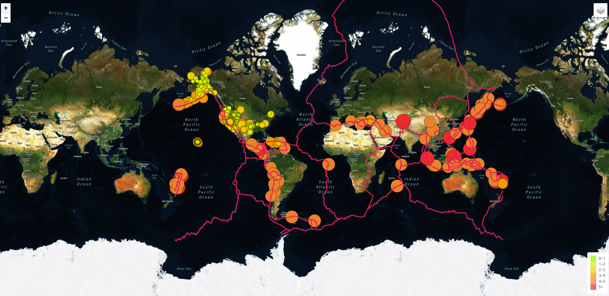

# Mapping Earthquakes Analysis

## **Overview of Mapping Earthquakes Analysis**: in this challenge, we completed added on the earthquake chart created as part of the module, to add two differents maps and the earthquake overlay.

### As part of the module, we used the GeoJSON Features Object method to map all recorded earthquakes in the past seven days. 

#### Our base layer contained two maps: a Streets map, and a Satellite Streets map. We used GeoJSON data directly from the USGS website, calling for a URL specific to the last 7 days of earthquakes. We updated the basic marker to a circle marker, and varied its size by the magnitude of each earthquake, and color coded each circle again by magnitude. Lastly, we also created a legend that would allow viewers to differentiate between the colors of each circle.

### In this challenge, we were asked to display the earthquake data in relation to the tectonic plates’ location on the earth, as well as all the earthquakes with a magnitude greater than 4.5, and finally a third map of our choosing.

### In summary, our final map includes the following:

1. a Streets map
2. a Satellite Streets map
3. a Navigation Streets map
4. all earthquakes within the last 7 days
5. all tectonic plates in red
6. all major earthquakes with magnitudes higher than 4.5 in the last 7 days
7. a legend showing the colors by magnitude level

